# Cloudflare Feedback Dashboard - Technical Report & Product Requirement Document

## 1. Product Brief & Executive Summary
**Project Name:** Cloudflare Voice - Intelligent Feedback Dashboard
**Version:** 1.0.0 (MVP)
**Status:** Deployed / Production Ready

*   **Live Prototype:** [https://my-feedback-dashboard.apurvasamali.workers.dev/](https://my-feedback-dashboard.apurvasamali.workers.dev/)
*   **GitHub Repository:** [https://github.com/Apurvaaaah/cloudflare-dashboard](https://github.com/Apurvaaaah/cloudflare-dashboard)

### 1.1 The Problem Statement
In the modern SaaS ecosystem, product feedback is fragmented. Users share their thoughts on **Twitter (X)**, **Discord communities**, **Support Tickets**, and **Community Forums**. 
For a Product Manager (PM) at Cloudflare, synthesizing this high-volume, unstructured data is a manual, time-consuming process. Critical signals (e.g., "Documentation is confusing for R2") are often lost in the noise, leading to slower iteration cycles and missed opportunities for customer delight.

### 1.2 The "Cloudflare Voice" Solution
"Cloudflare Voice" is a centralized intelligence layer that acts as a single pane of glass for all customer sentiment. It automates the "Ingest → Analyze → Act" loop:
1.  **Ingest:** Aggregates raw text from multiple mock sources.
2.  **Analyze:** Uses locally running LLMs (Llama 3) to categorize feedback, assign urgency scores, and calculate Sentiment/NPS.
3.  **Act:** Provides semantic search (Vector RAG) allowing PMs to ask questions like "What are users saying about cold starts?" and get relevant results instantly.

---

## 2. Product Manager Perspective: "How this helps me?"

### 2.1 Reducing "Time-to-Insight"
Traditionally, a PM might spend 4-5 hours a week reading through Discord logs or support CSV exports. 
*   **Without Dashboard:** Manual tagging in spreadsheets. High latency between "Feedback Received" and "PM Aware".
*   **With Dashboard:** Real-time feed. An angry user reporting a bug on Discord is flagged as **"High Urgency"** and classified as **"Bug"** within seconds.

### 2.2 Data-Driven Roadmap Decisions
Instead of relying on gut feeling ("I think people want better docs"), the dashboard provides data-backed evidence:
*   *"We have a 15% increase in Negative Sentiment regarding 'Wrangler Configuration' this week."*
*   *"The 'Zero Trust' category has the highest relative volume of 'Feature Requests'."*
This allows PMs to prioritize engineering resources where they move the needle most.

### 2.3 Closing the Feedback Loop
The dashboard isn't just for looking; it's for acting.
*   **Semantic Search:** PMs can quickly find reference customers for user interviews. (e.g., Search "Who asked for Python support?" -> Get 5 user IDs to email).
*   **NPS Fingerprint:** Understand the "Temperature" of the user base before launching a new feature.

---

## 3. Comprehensive Architecture & Technology Stack

### 3.1 System Architecture
The system follows a modern **Serverless RAG (Retrieval-Augmented Generation)** pattern, entirely hosted on the Cloudflare Developer Platform.

```mermaid
graph TD
    %% Styling Definitions
    classDef user fill:#ffffff,stroke:#333333,stroke-width:2px;
    classDef frontend fill:#e0f2fe,stroke:#0284c7,stroke-width:2px,color:#0c4a6e;
    classDef worker fill:#f48120,stroke:#ea580c,stroke-width:2px,color:#ffffff,font-weight:bold;
    classDef ai fill:#ffedd5,stroke:#f97316,stroke-width:2px,color:#9a3412;
    classDef db fill:#f1f5f9,stroke:#64748b,stroke-width:2px,color:#334155;
    
    %% Nodes
    User("👤 Product Manager") 
    Frontend("💻 React SPA (Static Assets)")
    Worker("⚡ Cloudflare Worker")
    
    subgraph CloudflareStack ["☁️ Cloudflare Ecosystem"]
        direction TB
        Llama("🤖 Workers AI<br/>(Llama 3 Analysis)")
        Embed("🧠 Workers AI<br/>(BGE-Base Embeddings)")
        D1[("🗄️ D1 Database<br/>(SQL Metadata)")]
        Vector[("🔍 Vectorize Index<br/>(Semantic Vectors)")]
    end

    %% Connections
    User -->|View Dashboard| Frontend
    Frontend -->|Query Data| Worker
    
    Worker -->|1. Ingest Feedback| Llama
    Worker -->|2. Vectorize Text| Embed
    
    Llama -.->|JSON| Worker
    Embed -.->|Vectors| Worker
    
    Worker -->|3. Store Metadata| D1
    Worker -->|4. Store Vectors| Vector
    
    %% Classes
    class User user;
    class Frontend frontend;
    class Worker worker;
    class Llama,Embed ai;
    class D1,Vector db;
    
    %% Styles for Subgraph
    style CloudflareStack fill:#fff7ed,stroke:#fdba74,stroke-width:2px,stroke-dasharray: 5 5
```

### 3.2 Deep Dive: Technology Choices & Rationale

#### A. Compute Layer: Cloudflare Workers
*   **Choice:** **Cloudflare Workers** (Standard ES Modules).
*   **Why we chose it:**
    *   **Zero Cold Starts:** Unlike AWS Lambda, Workers run on Isolates, meaning the dashboard API responds in milliseconds, even after periods of inactivity.
    *   **Unified Glue:** Workers allow us to "bind" easily to AI, D1, and Vectorize without managing connection pools, secrets for external APIs, or VPCs.
*   **Alternatives Considered:** *AWS Lambda / Vercel Functions*. Rejected because they introduce latency (cold starts) and require complex networking to talk to Cloudflare-native services like D1.

#### B. Database Layer: Cloudflare D1 (SQLite)
*   **Choice:** **Cloudflare D1**.
*   **Why we chose it:**
    *   **Structured Querying:** We needed to filter feedback by multiple dimensions (Region, Urgency, Product Category) simultaneously. SQL is the gold standard for this.
    *   **Cost & Performance:** D1 is effectively free for this scale and lives on the edge. Queries for the dashboard (e.g., `SELECT * FROM feedback WHERE urgency='High'`) are blazing fast.
*   **Alternatives Considered:** *Cloudflare KV*. Rejected because KV provides "Eventual Consistency" and is poor for complex filtering/sorting logic.

#### C. Vector Search: Cloudflare Vectorize
*   **Choice:** **Cloudflare Vectorize**.
*   **Why we chose it:**
    *   **Native Integration:** Inserting a vector is a simple method call (`env.VECTOR_INDEX.insert()`) within the Worker. No external API keys or latency penalties for calling a 3rd party service.
    *   **Semantic Power:** It enables the "Search by meaning" feature, which is the "Magic" of this dashboard.

#### D. AI Inference: Workers AI (Llama 3 & BGE-Base)
*   **Choice:** **@cf/meta/llama-3-8b-instruct** for analysis; **@cf/baai/bge-base-en-v1.5** for embeddings.
*   **Why we chose it:**
    *   **Privacy & Speed:** Data never leaves Cloudflare's network. We don't send user feedback to OpenAI's servers, which is a huge privacy win for enterprise data.
    *   **Simplicity:** It's just a function call in the code. No separate Python backend or GPU provisioning required.

#### E. Frontend: React + Vite
*   **Choice:** **React (Single Page App)** built with **Vite**.
*   **Why we chose it:**
    *   **Rich Interactivity:** A dashboard requires complex state management (filters, sorting, expanded rows) which React handles perfectly.
    *   **Deployment:** The build output (`dist/`) is served as **Static Assets** by the Worker, meaning we have a single deployment artifact for both frontend and backend.

---

## 4. Friction Log: The Developer Experience
*An honest critique of the "Building on Cloudflare" experience.*

### Issue 1: The "JSON Parsing" Roulette with LLMs
*   **Context:** We rely on Llama 3 to output strict JSON for our database.
*   **The Problem:** LLMs are chatty. Even when told "Return ONLY JSON", they often reply with *"Here is your JSON: { ... }"* or wrap it in Markdown code blocks. This causes `JSON.parse()` to throw errors in the Worker, failing the request.
*   **The Fix:** I implemented a robust regex fallback (`match(/\{[\s\S]*\}/)`) to extract the JSON object from the noise.
*   **Recommendation:** Cloudflare Workers AI should introduce **"Structured Outputs"** or **"JSON Mode"** (similar to OpenAI's API) that enforces a schema at the API level, guaranteeing valid JSON every time.

### Issue 2: Distributed Data Consistency (D1 vs Vectorize)
*   **Context:** We write to two databases: D1 (Metadata) and Vectorize (Embeddings).
*   **The Problem:** There is no distributed transaction. If `D1.insert()` succeeds but `Vectorize.insert()` fails (e.g., due to index limits), we end up with "Zombie Data" (records that exist but can't be searched).
*   **The Impact:** This requires complex manual rollback logic in code, which is brittle.
*   **Recommendation:** A "Unified Storage" abstraction where one insertion automatically populates both the SQL table and the Vector Index would simplify RAG apps significantly.

### Issue 3: The "Neuron Limit" Verification Gap
*   **Context:** While stress-testing the ingestion pipeline with a loop of 50 feedback items.
*   **The Problem:** I hit the "Neurons Limit" (Rate Limit) for the Workers AI free tier. The error message was clear, but *anticipating* it was hard. `wrangler dev` doesn't show a "Quota Usage" bar.
*   **Recommendation:** A command like `wrangler ai quota` that shows current usage vs. limits would help developers plan their batch sizes better.

---

## 5. Future Roadmap ("If I had more time...")

If this project were to evolve into a production service, the following feature set would be prioritized:

1.  **Discord Bot Integration (Ingestion)**
    *   *Concept:* A bot residing in the Cloudflare Developers Discord that listens to `#feedback` channels.
    *   *Mechanism:* It would listen for the `!feedback` command or monitor sentiment, automatically `POST`ing the message content to this dashboard's ingress API.

2.  **Unsupervised Clustering (Analysis)**
    *   *Concept:* Automatically grouping similar feedback without predefined categories.
    *   *Tech:* Use K-Means clustering on the vectors stored in Vectorize to identify "Emerging Themes" (e.g., "15 users reported 500 errors on R2 uploads today").

3.  **"Close the Loop" Automation (Action)**
    *   *Concept:* Automated follow-ups.
    *   *Mechanism:* When a PM marks an issue as "Resolved", the system uses MailChannels (via Workers) to email all users who reported that specific bug, turning detractors into promoters.

4.  **Multi-Language Support (Global Voice)**
    *   *Concept:* Seamlessly handling feedback in Japanese, Spanish, or French.
    *   *Tech:* Use Workers AI (@cf/meta/m2m100-1.2b) to detect language and translate all feedback into English before analysis, ensuring global customer voices are heard equally.

5.  **Bi-Directional Issue Sync (Linear/Jira)**
    *   *Concept:* Single source of truth.
    *   *Mechanism:* Instead of just linking to a ticket, the dashboard would sync status changes. If a Linear issue closes, the corresponding feedback in the dashboard is marked "Resolved" automatically.

6.  **Sentiment Trend Alerts (Slack/PagerDuty)**
    *   *Concept:* Proactive anomaly detection.
    *   *Mechanism:* A Scheduled Worker runs hourly to check if negative sentiment for a specific category (e.g., "Login") spikes by >20%. If so, it immediately posts an alert to the `#product-alerts` Slack channel.

---

## 6. Vibe-coding Context
**Platforms Used:** Antigravity, Google Gemini (Agentic Mode) & Cursor.
---

> *This report was generated by the Antigravity Agent. Architecture diagrams generated with Mermaid.*
